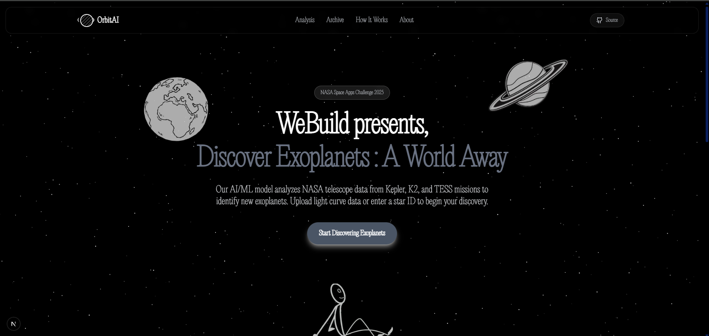
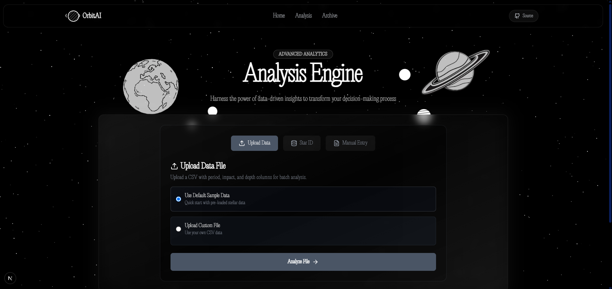
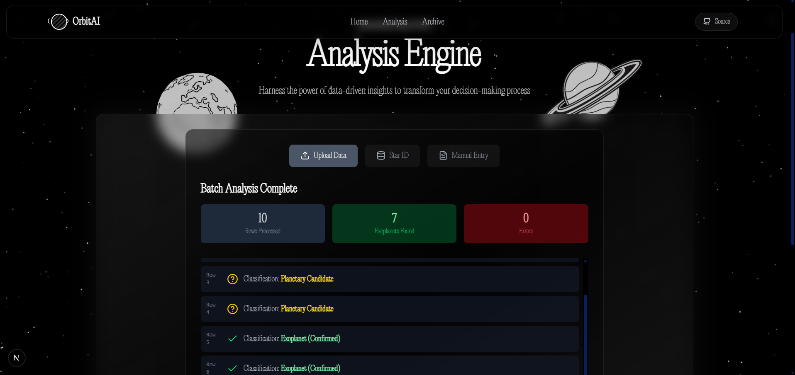
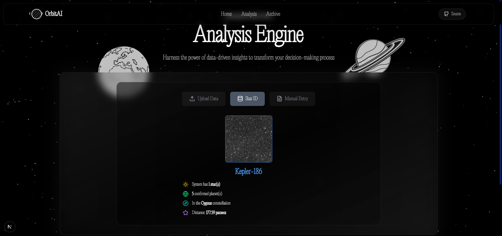
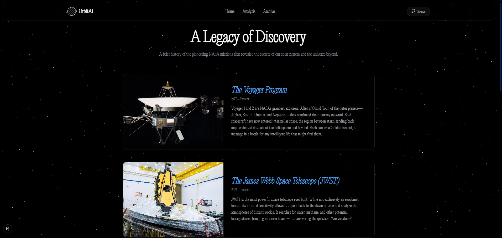
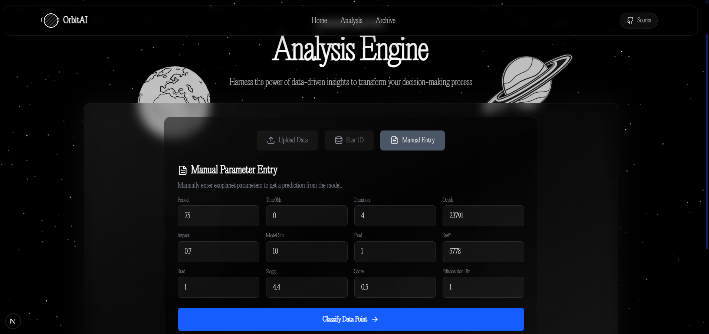

# 🌌 A World Away: Hunting for Exoplanets with AI

> A submission for the **NASA Space Apps Challenge 2025**.  
> This project introduces **OrbitAI**, a web-based platform designed to accelerate the discovery and validation of exoplanets using machine learning.

---

📽️ Project Demonstration
OrbitAI in action!

🖼️ Key Screenshots

🎥 Video Demos
<video src="media/videos/webpage.mp4" controls width="750">
    Webpage Demo Video
</video>
 
<video src="media/videos/analysis.mp4" controls width="750">
    Analysis Feature Demo
</video>

---

## 📜 The Challenge

The discovery of over 4,000 exoplanets has been revolutionary, but the detection process remains slow and challenging. Techniques such as the **transit method** are limited by rare orbital alignments, and a major bottleneck is the high rate of **false positives** (e.g., eclipsing binary stars).  
These issues require time-consuming manual validation, especially for data from missions like **Kepler**.

The goal of this project is to create a **reliable, automated system** to prioritize the most promising exoplanet candidates — accelerating the search for habitable worlds and expanding our understanding of the universe.

---

## 💡 Our Solution: OrbitAI

To tackle this challenge, we built **OrbitAI** — a sleek, user-friendly web platform that streamlines exoplanet detection.  
OrbitAI leverages a powerful machine learning model to analyze astronomical data and deliver instant predictions — making exoplanet vetting **fast, accurate, and accessible**.

---

### ✨ Key Features

- **Batch Analysis**: Upload a CSV file containing multiple planet candidates to receive a full classification report. The interface summarizes total rows processed, exoplanets found, and any detected errors.

- **Planet Lookup**: Search by star or planet name (e.g., `Kepler-146 b`) to fetch real-time details like status, orbital period, radius, and AI-generated confidence scores from NASA archives.

- **Manual Entry**: Input specific transit parameter values manually to get instant predictions from our trained AI model.

---

## 🛠️ Technical Implementation

OrbitAI combines a robust backend with a clean, responsive frontend — all powered by a carefully designed **machine learning pipeline**.

### 📊 Data Sources

- **Primary Datasets:** - NASA’s **Kepler Object of Interest (KOI)** dataset  
  - NASA’s **TESS Object of Interest (TOI)** dataset  
- **Research Basis:** Methodology inspired by peer-reviewed research on **ensemble-based ML for exoplanet identification**.

---

### 🤖 Machine Learning Pipeline

A visual representation of our end-to-end data processing and modeling workflow:

1. **Preprocessing** - Outlier handling using **IQR** - Missing value imputation via **SimpleImputer / KNNImputer** - Feature scaling (StandardScaler + log transformations)  
   - Data leakage prevention and validation checks  

2. **Feature Engineering** - Introduced a *"natural vs. artificial score"* feature to improve model discrimination.

3. **Model Architecture** - Core model: **Voting Classifier** ensemble  
   - Components: **RandomForest**, **XGBoost**, **CatBoost** - Validated against a **LightGBM** baseline for performance benchmarking.  

---

### ⚙️ Backend Architecture

- **Language:** Python  
- **Key Components:** - `ensemble_model.sav` and `scaler.sav` — pre-trained model and scaler  
  - `main.py` — entry point and API server  
  - `requirements.txt` — dependency management  
  - `experiment*.ipynb` — model training notebooks  

---

## 🌳 Project Structure

.
├── backend/
├── frontend/
├── img/                       <-- New Image Folder
├── __pycache__/
... (26 lines left)
